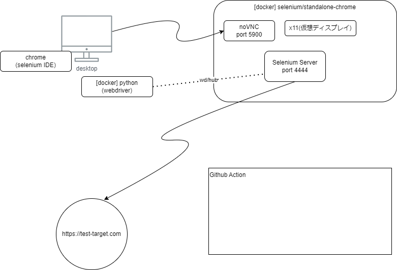

# study-selenium-2023



## docker image

```
docker pull selenium/standalone-chrome
```

## docker run

```
docker run --rm -d -p 4444:4444 -p 7900:7900 --dns=8.8.8.8 --shm-size="2g" selenium/standalone-chrome:latest
```

## pythonからseleniumを使う

```
docker pull python
docker build -t my-python-app .
docker run -it --rm -w /home -v $(pwd):/home --dns=8.8.8.8 python bash
docker run -it --rm -w /home -v $(pwd):/home --dns=8.8.8.8 python python ./t001.py
```


## Selenium IDE (chrome extention) 
pythonのコードを生成することもできる


